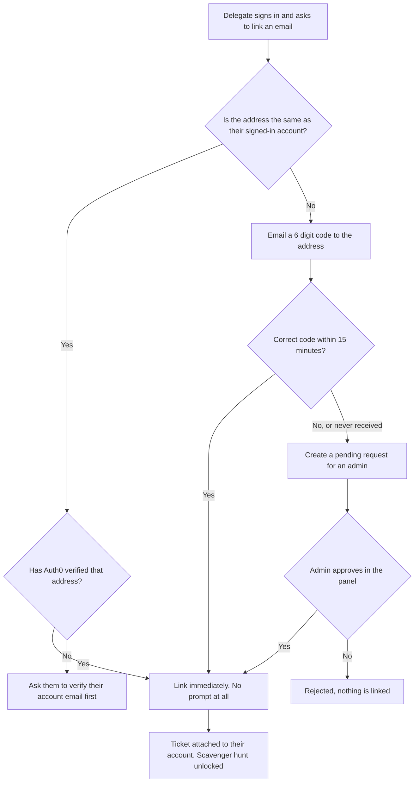

# Ticket Linking Security: Proposal

**Status:** proposal, not built. Waiting on a decision from the chairs.
**Written:** September 2026
**Decision needed on:** whether to build this, and whether we pay for an email
sender.

---

## The problem

Today, anyone with a CUSEC account can claim anyone else's ticket by typing
their email address.

`POST /api/users/link-email` links a ticket to your account if the address you
send is on the ticket list and nobody has claimed it yet. That is the whole
check. It never asks whether the address is actually yours.

So the attack is:

1. Sign up for a CUSEC account with any email.
2. Sign in.
3. Submit a delegate's email address to the linking endpoint.
4. Their ticket is now attached to the attacker's account.

The real delegate then cannot link their own ticket, because it is already
taken. `POST /api/ticket-wizard/claim` has the same weakness: it confirms that
the address has a paid order at Ticket Tailor, but never that the caller owns
the address.

### Two things make it worse

**It tells attackers who to target.** The endpoint answers differently for
"that email has no ticket", "that ticket is already claimed" and success. An
attacker can walk through a list of guessed addresses and build an exact list
of who holds an unclaimed ticket, then take all of them.

**Nothing is limited or recorded.** There is no rate limit and no audit log, so
a script can try thousands of addresses and we would not know it happened.

### Why we cannot just require a ticket code

Head delegates buy tickets in bulk from Ticket Tailor and hand us a list of
delegate emails afterwards. Those delegates never see a purchase confirmation
or a per-ticket code, so any fix that depends on the delegate holding a secret
from the purchase will not work for them. Email is the only identifier we have
for a bulk-purchased delegate, so the fix has to make email trustworthy rather
than replace it.

---

## The rule we want

> You may only link an email address you have proven you control.

That is the single property missing today. Everything below exists to
establish it with as little friction as possible.

---

## The proposed solution

Three paths, in order. Most people only ever touch the first one and notice
nothing.

### Path A: same address, zero friction

If the address being claimed is the same as the Auth0 account you are signed in
with, and Auth0 says that address is verified, link it immediately. No code, no
waiting, no prompt.

Auth0 already proved control of that mailbox when the account was created, so
there is nothing more to check. Social logins such as Google arrive verified.

**This covers almost everyone**, including bulk-purchase delegates who sign up
with the address their head delegate listed.

### Path B: different address, one extra step

If the address differs from the signed-in account, we email a six digit code to
the address being claimed. Enter the code and the link completes.

- The code expires after 15 minutes.
- It works once.
- Five wrong guesses and it is destroyed.

This is the actual proof of mailbox control. It is self-serve, so nobody waits
on a human.

**This needs an email sender we do not currently have.** See "What this costs"
below.

### Path C: admin approval, for the rest

If someone cannot receive the code, for example a shared or expired school
address, the attempt becomes a pending request in the admin panel. An admin
approves it in the Registered Users area.

No email is needed for this path, so it also serves as the fallback if the
email sender is ever down.

### Supporting changes

Four smaller pieces ship alongside the three paths.

**One generic failure message.** Every rejection reads the same, so the
endpoint stops telling attackers which tickets exist and which are unclaimed.

**The same fix on `/api/ticket-wizard/claim`.** It routes through the same
verified path rather than keeping its own weaker one.

**Audit logging on every attempt**, successful or not. We would currently have
no record that an attack happened.

**Rate limiting**, described in its own section below.

---

## How it flows

---

## Rate limiting

Rate limiting is part of this work, not a separate project. It goes on two
tiers because the two kinds of endpoint need different guarantees.

**Tier 1, the security-critical routes.** Linking, claiming, requesting a code
and verifying a code. These use counters stored in MongoDB with an expiry
index, so the limit holds across every serverless instance. An in-memory
counter cannot do this, because Vercel spreads requests over many instances and
each would keep its own separate count.

**Tier 2, everything else.** Survey submission, challenge submissions, team
create and join, shop and collectible redeems, status polling, admin reads.
These use a simple in-memory window. It is best-effort rather than exact, which
is fine for abuse control.

Limits are keyed both by account and by the target email address, so neither a
single attacker account nor a single victim address can be hammered.

---

## What this costs

| Item | Cost |
|---|---|
| Email sender (Resend) | Free tier covers our volume |
| Verifying `cusec.net` as a sending domain | Free, a DNS record |
| Turning on Auth0 email verification | Free, a dashboard setting |
| Build time | Roughly a day of work |

There is no paid dependency here unless our email volume grows well past what a
conference of this size sends.

---

## What the chairs need to decide

1. **Do we build this?** The current behaviour is a working account-takeover
   path against any delegate whose email address someone can guess.

2. **Do we create a Resend account?** Without it, Path B does not exist and
   every mismatch falls through to Path C, which means an admin approves each
   one by hand. Workable, but it is manual work during the busiest week.

3. **Do we turn on Auth0 email verification for password signups?** Path A
   rests on it. Without it, nobody qualifies for the zero-friction path and
   everyone goes through Path B or C.

---

## What does not change

- Head delegates keep buying in bulk and handing us a list of emails. Nothing
  about that process changes.
- Those delegates still link with no extra step, through Path A, as long as
  they sign up with the address on the list.
- The ticket wizard's automatic linking, by webhook and by API reconciliation,
  is unaffected. It already only links an order to the account that shares its
  address, which is Path A by another name.

---

## Related files

| File | What it does today |
|---|---|
| `src/app/api/users/link-email/route.ts` | The vulnerable endpoint |
| `src/app/api/ticket-wizard/claim/route.ts` | Same weakness, ticket wizard version |
| `src/lib/ticketLinking.ts` | Shared linking logic, the safe automatic paths |
| `src/lib/models.ts` | `RegisteredUser`, the ticket allowlist |
| `src/lib/adminAuditLogger.ts` | Where attempt logging would go |
